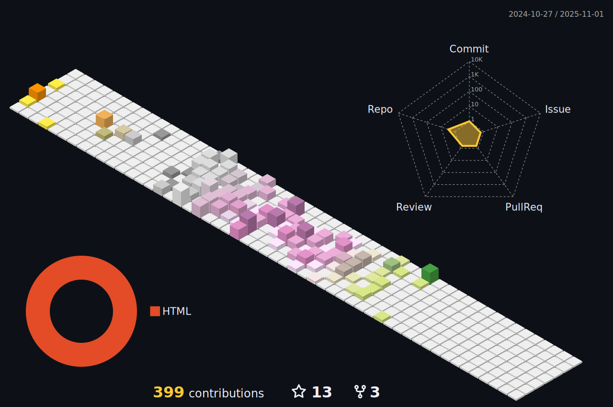

### 🌟 Welcome to My GitHub Galaxy! 🌟

## About Me

🌱 I am currently a student at Hangzhou Dianzi University.

🔭 I have a deep passion for **Golang**. Its efficiency, simplicity, and powerful capabilities in system and network programming have captivated me, and I am dedicated to mastering this language.

🧑 I am currently the core member of [HDUHELP](https://github.com/hduhelp), a dynamic club at Hangzhou Dianzi University. We're all about tech, innovation, and community service.

## Let's Connect

💬 I hope to make friends with many kind and like-minded individuals. Feel free to reach out to me for collaborations, or just a friendly chat about the latest in tech.

🤔 I'm on a continuous journey to enhance my coding skills. It would be fantastic if someone could mentor me and guide me through the coding.

🌐 You can reach me at asetcy@gmail.com.

## Articles

[消息队列在杭电助手消息系统的实践和应用](https://mp.weixin.qq.com/s/xAATZBfoEWsz92viKLP6Vw)

## 📊 GitHub Stats:

